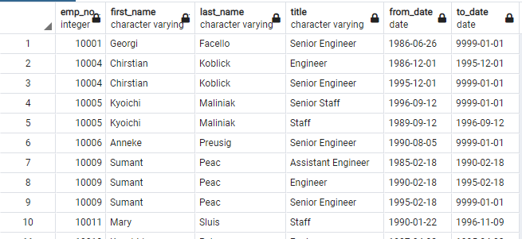
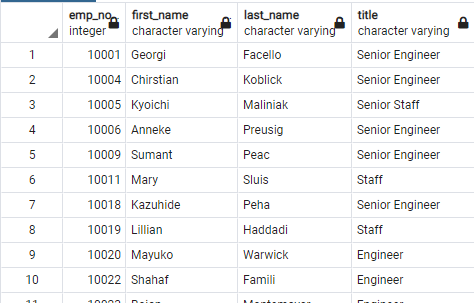
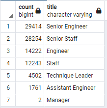
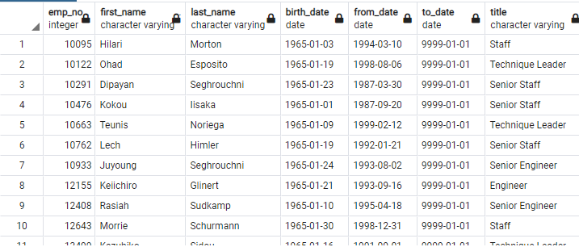
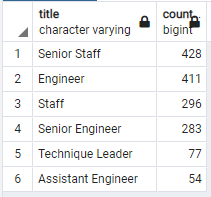
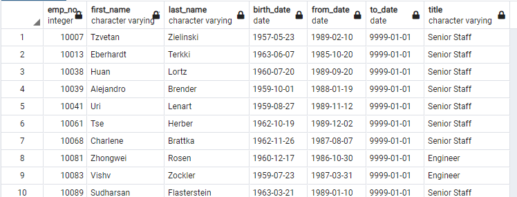

# Pewlett Hackard Retirement Database Analysis

## Overview
### In an effort to prepare for a "silver tsunami" of retiring employees, Pewlett Hackard has tasked myself and Bobby with determining the number of retiring employees per title and identifying employees eligible to participate in the developing mentorship program. This mentorship program will assist in training and mentoring new employees as many current employees reach retirement age.

## Results

- We created a retirement titles table to display all employees born between 1952 and 1955 and the titles they've held over the years.

- We then narrowed down the retirement titles table to have only one entry per employee which displayed their most recent title. We named this new table unique titles.

- Using the unique titles table, we grouped and tallied the number of employees by job title to provide an easy-to-read count of retiring employees for each job title.

- To determine employees eligible for the mentorship program, we created a table of current employees that were born in 1965 (to provide enough time for them to mentor others before they retire). This table included the employee's names, ID number, birth date, dates of employment, and current title.

## Summary
As the "silver tsunami" begins to make impact, 90,398 roles will need to be filled, provided only those employees born between 1952 and 1955 retire.

There are only 1,549 employees eligible for the planned mentorship program. In a 1:1 mentorship scenario, only 1.7% of new employees coming into the roles would receive prior mentorship, indicating there are not enough qualified, retirement-ready employees to mentor the next generation.

The eligible employees for the mentorship program grouped by title are in the table below. Compared to the retiring titles table, there are no managers eligible to mentor the replacements for the two retiring managers.

However, if the mentorship eligibility program is expanded to look at not just employees born in 1965, but instead at  employees younger than the minimum retirement age (1955-12-31) that have been working at Pewlett Hackard for more than 10 years (prior to 1990-01-01), 50,143 employees are available to potentially mentor new employees. These employees have been working with the company for many years and could provide significant mentorship despite not being born in 1965. If these employees mentor two new employees, the mentorship program can cover the "silver tsunami".

